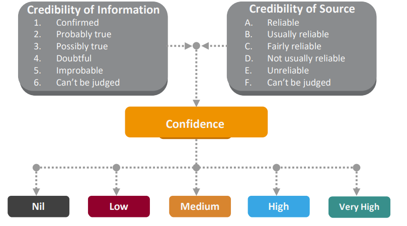

# Confidence Levels

The admiralty scale rates sources with letters from a (reliable) to g (purposefully deceptive) and information credibility from 1 (confirmed by multiple sources) to 6 (cannot be validated).

.png>).png>)

.png>)

